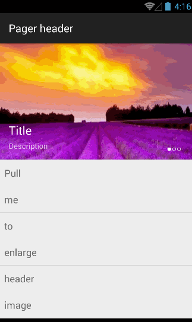

#ZoomListView

A listView has a header which will enlarge when you overscroll listView.



##Usage

*Add as dependency in gradle*

`compile 'me.biubiubiu.zoomlistview:library:0.1'`

*Define layout in xml*

```xml
    <com.bettycc.zoomlistview.library.ZoomListView
        android:id="@+id/list"
        android:layout_width="match_parent"
        android:layout_height="match_parent"
        />
```

*Set image view background*

```java
        listView.setHeaderResource(R.drawable.demo);
```

*Add header content view*
```java
        View view = getLayoutInflater().inflate(R.layout.header_container, listView.getHeaderView(), false);
        listView.setHeaderContentView(view);
```


##Customization

*Configure header height*

        app:headerHeight="80dp"
